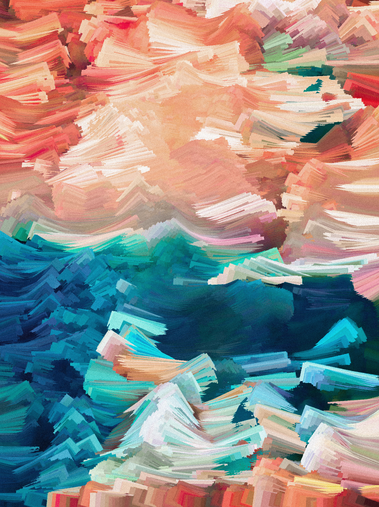
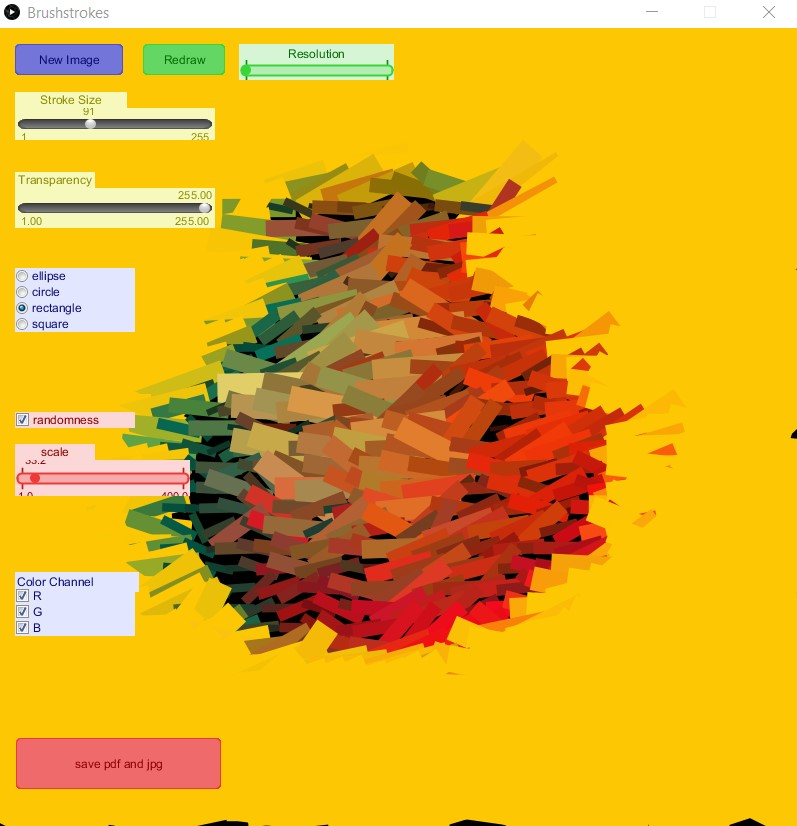

# Brushstroke App 01
 Generates vector paintings from Images

 

## Dependencies
1. [Processing](https://processing.org/)
2. [Java 8](http://java.com/download)
3. [G4P for Processing](http://www.lagers.org.uk/g4p/download.html) Can be downloaded from within processing. Tools>Add Tool>Libraries

## Build
1. Open the source code in processing from source folder
2. To run press the play button
3. To build file>export application

## Warnings on Usage
1. Cranking the resolution slider can crash the program.

## Output
 1. The PDF will be really huge and difficult to handle
 2. The image is a 8000x8000 PNG file.
 3. Both in Output folder
 4. Saving might take a few minutes
 5. Results might be different from preview

